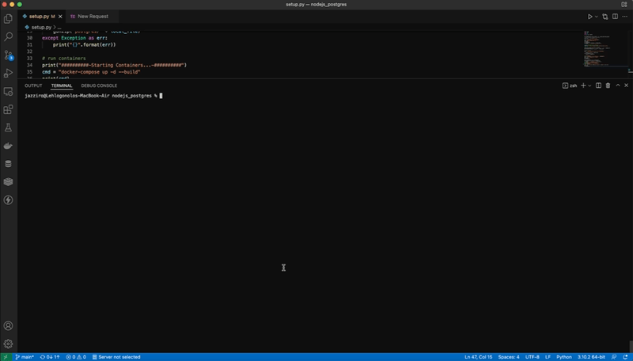

# Setup Guide

### Prerequisite:
- docker
- docker-compsoe
- python3 *for quick setup
- python modules: *for quick setup
  - ```pip3 install wget```
  - ```pip3 install ssl```
  - ```pip3 install sh```
- gunzip *for manual setup

### Quick Setup:
```shell
python3 setup.py
```

### Manual Setup:
```shell
wget https://datasets.imdbws.com/title.basics.tsv.gz -O postgres/title.basics.tsv.gz

gunzip postgres/title.basics.tsv.gz

docker-compose up -d --build
```
### Test API
```shell
curl localhost:3000/api/v1/movies | node -e "console.log( JSON.stringify( JSON.parse(require('fs').readFileSync(0) ), 0, 1 ))"
```
OR
```shell
curl localhost:3000/api/v1/movies | python3 -m json.tool  
```

### Video:
